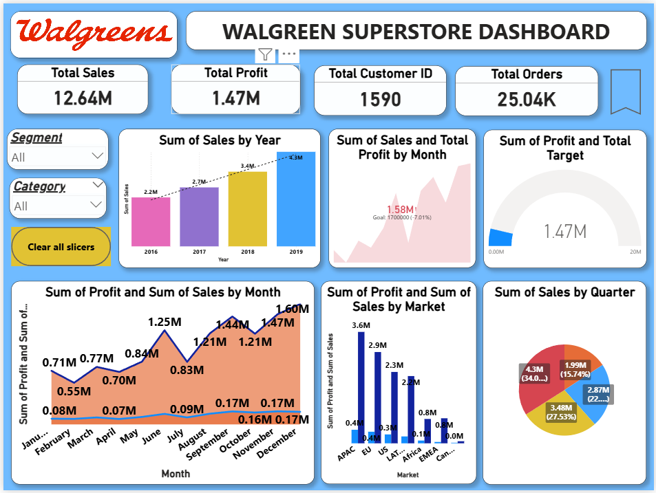
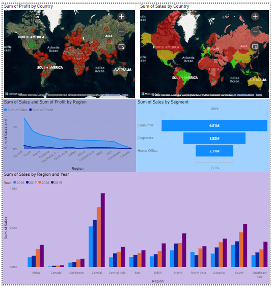

# Walgreen-Superstore-Powerbi-Dashboard
## Project Overview
This Power BI project analyzes sales performance, profitability, customer behavior, product performance, and regional trends for the Walgreen Superstore business.
The dashboard helps management monitor KPIs, identify profitable markets, evaluate customer segments, and track business growth over time.

## Business Objectives

- Analyze overall sales and profit performance.
- Monitor yearly and monthly sales trends.
- Identify top-performing countries and regions.
- Evaluate customer segments and customer lifetime value (CLV).
- Track delivery performance (On-Time vs Delayed).
- Identify top profitable products.
- Compare market and regional performance.

---

## Key KPIs

| KPI | Value |
|------|--------|
| Total Sales | 12.64M |
| Total Profit | 1.47M |
| Total Orders | 25.04K |
| Total Customers | 1,590 |

---

## Dashboard Features

### Executive Overview
- Total Sales
- Total Profit
- Total Orders
- Customer Count

### Sales Analysis
- Sales by Year
- Sales by Quarter
- Monthly Sales Trends

### Profit Analysis
- Monthly Profit Trends
- Market-wise Profit Analysis

### Regional Analysis
- Sales by Region
- Profit by Region
- Regional Performance Comparison

### Customer Analysis
- Customer Segmentation
- Customer Lifetime Value (CLV)
- Customer Age Category Analysis

### Product Analysis
- Top Profitable Products
- Category Performance
- Product Ranking

### Delivery Analysis
- On-Time Deliveries
- Delayed Deliveries

---

## Tools Used

- Power BI Desktop
- Power Query
- DAX
- Excel

## Skills Demonstrated

- Data Cleaning
- Data Modeling
- DAX Calculations
- KPI Design
- Interactive Dashboards
- Business Intelligence Reporting

---

## Author
Rohit Prajapati
---

## License
This project is licensed under the MIT License.
